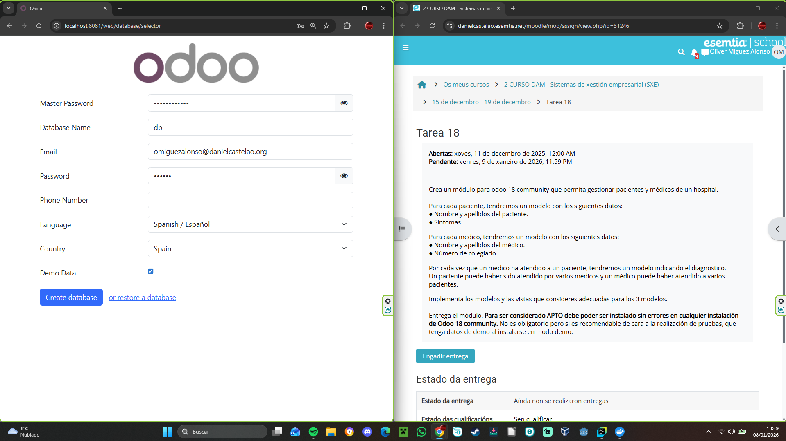
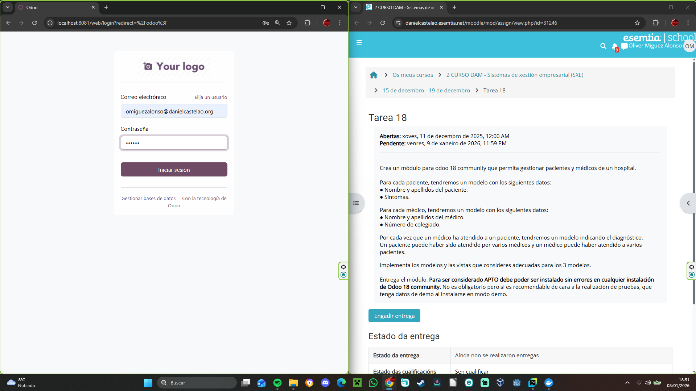
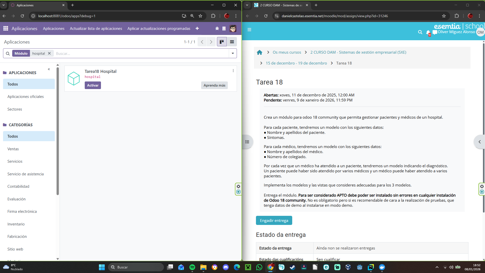
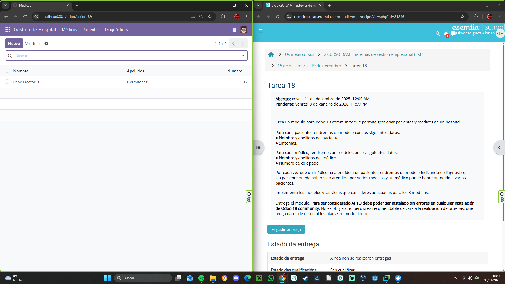
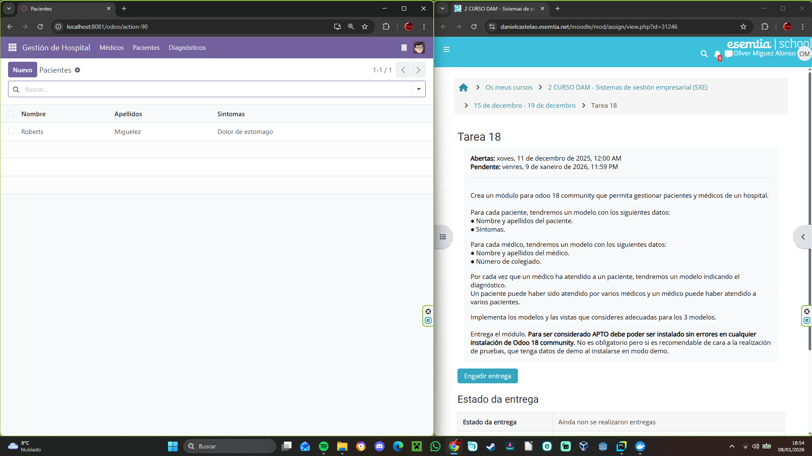

# Tarea 18 SXE

## 1º Accedemos a odoo

## 2º Verificamos si se instaló el módulo correctamente

## 3º Lo activamos 
(Ojo recordar activar el modo desarrollador y actualizar la lista de aplicaciones para asegurarnos de que aparecerá nuestro módulo)

## 4º Veríficamos que cada uno de los apartados funcione
### Médicos

### Pacientes

### Diagnosticos
